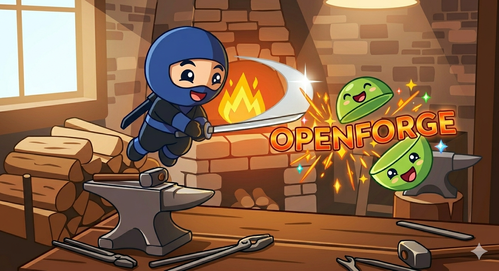
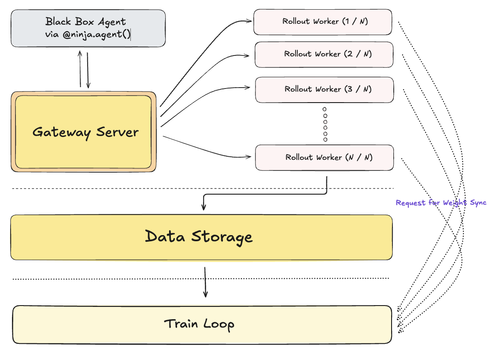
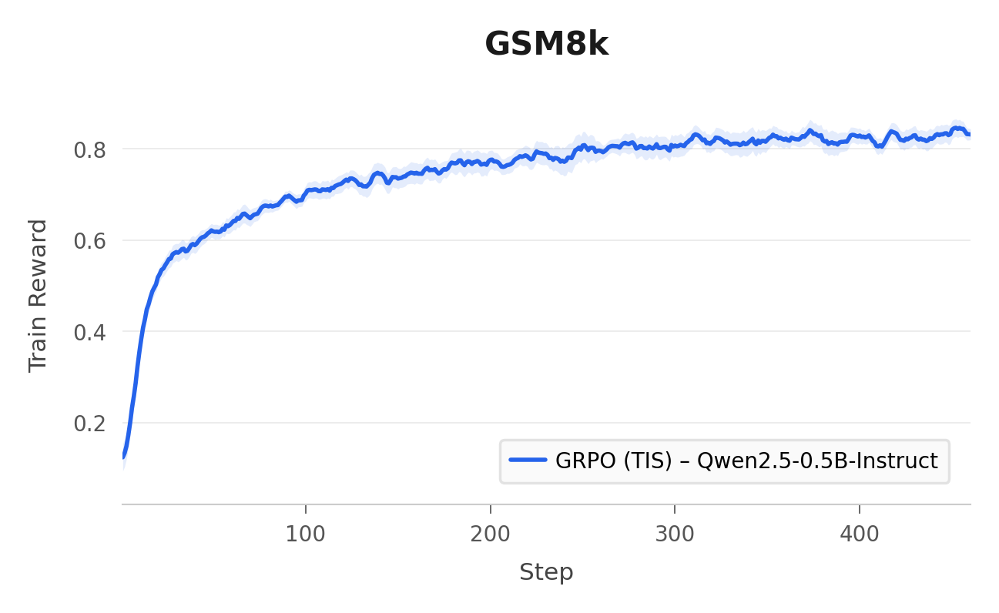
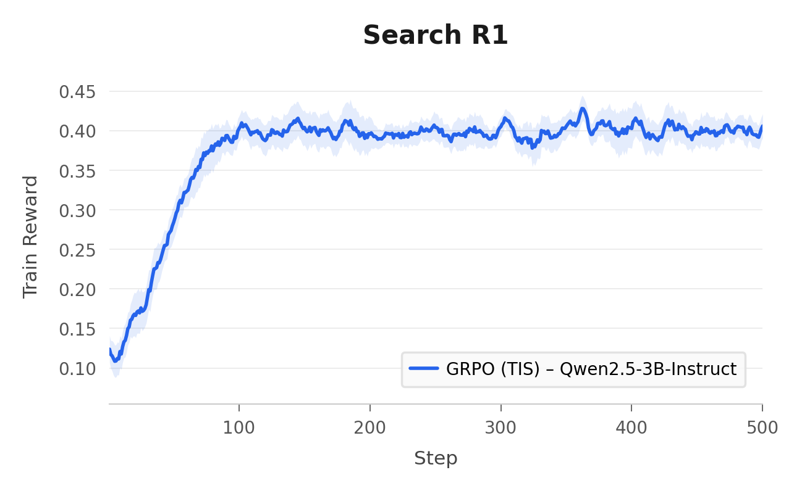

> Banner image generated with Google Nano Banana

# openforge

Gateway-first post-training for LLM agents. RL-as-a-Service (RLaaS).

Train the agent, not the glue code.


## News

- [2026/3/28] The public surface is one CLI (`openforge`) plus one Python API (`openforge.ninja`) for agent registration, sampling, training, validation, and checkpoint export.
- [2026/3/28] In-tree runtime configs support `grpo` and `grpo_tis` on a Ray + SGLang + FSDP2 stack.
- [2026/3/28] Active gateway/session discovery uses machine-local shared state so scripts and CLI commands can attach to the same live runtime.

---

## TL;DR

> **openforge** is a gateway-first post-training framework for LLM agents. It keeps gateway lifecycle, rollout collection, training, checkpoint export, and local active-state discovery behind one surface, then exposes a small Python API so you can train an agent by writing normal OpenAI-style calls plus a reward function.

Most post-training stacks ask you to edit launch scripts, trainer internals, rollout code, and shell state at the same time. openforge uses YAML to start the runtime, records the active gateway and session on the local machine, and lets Ninja agents attach to that environment automatically.

> **Highlights:** Gateway-first control plane | One public CLI | `@ninja.agent()` + `ninja.train(...)` | Active local discovery | Config-first runtime setup | GRPO and GRPO+TIS

## Contents

- [System Overview](#system-overview)
- [The Ninja API](#the-ninja-api)
- [Features](#features)
- [Roadmap](#roadmap)
- [Contributing](#contributing)
- [openforge Quick Start](#openforge-quick-start)
- [Configuration](#configuration)
- [Ninja API Details](#ninja-api-details)
- [Algorithms](#algorithms)
- [Development](#development)
- [Citation](#citation)

## System Overview

High-level architecture:



## The Ninja API

This is the center of the project:

```python
import openforge.ninja as ninja


@ninja.agent()
def agent(client, *, prompt: str, target: str) -> float:
    response = client.chat.completions.create(
        model="Qwen/Qwen2.5-0.5B-Instruct",
        messages=[{"role": "user", "content": prompt}],
    )
    reward = ...
    return reward


summary = ninja.train(
    agent,
    inputs=[{"prompt": "2 + 2 = ?", "target": "4"}],
    group_size=8,
)
```

A basic train/validation loop looks like this:

```python
import openforge.ninja as ninja


@ninja.agent()
def agent(client, *, prompt: str, target: str) -> float:
    response = client.chat.completions.create(
        model="...",
        messages=[{"role": "user", "content": prompt}],
        ...,
    )
    text = ...
    reward = ...
    return reward


train_batches = ...
validation_path = "..."

for update_index, batch_inputs in enumerate(train_batches, start=1):
    ninja.train(
        agent,
        inputs=batch_inputs,
        group_size=8,
        ...,
    )

    if update_index % 10 == 0:
        ninja.validate(
            agent,
            file_path=validation_path,
            ...,
        )

agent.save()
```

Important API points:

- `agent(...)` runs one trajectory through the active gateway and returns one reward.
- `agent.sample(requests=[...], group_size=N)` collects one or more stored trajectories without waiting for a train update.
- `ninja.train(agent, inputs=[...], group_size=N)` runs grouped trajectories, stores them, and waits for those trajectories to be trained before returning a summary.
- `ninja.validate(agent, file_path=...)` runs validation requests against the active session and returns validation metrics.
- `agent.save()` exports the current checkpoint through the active session.

If a gateway and session are active, `@ninja.agent()` discovers them automatically. If you need to target a different gateway explicitly, pass a `GatewayServerConfig` object to the decorator.

## Features

### Gateway-first control plane

openforge puts runtime ownership behind the gateway. The gateway owns session lifecycle, health/status endpoints, generation routing, trajectory bookkeeping, and checkpoint export.

### One public CLI

The user-facing CLI is `openforge`. It starts and stops the gateway, starts and stops the active session, and renders live status with `openforge watch`.

### Small Python agent surface

Ninja agents are plain Python functions registered with `@ninja.agent()`. If you can write a reward function around `client.chat.completions.create(...)`, you can train with openforge.

### Active local discovery

Once a gateway and session are active, Ninja scripts attach automatically. The shared local state lives at:

- `$OPENFORGE_CACHE_HOME/openforge/active_gateway.json`
- `~/.cache/openforge/active_gateway.json` when `OPENFORGE_CACHE_HOME` is unset

### Config-first runtime setup

Cluster shape, model settings, rollout parameters, and training topology live in YAML. The CLI starts things from config paths; it does not become a second config system.

### Validation and checkpoint export

The active session exposes grouped training, file-backed validation, and checkpoint export through the same Ninja surface. That keeps rollout, training, validation, and checkpointing behind one contract.

---

## Roadmap

Our short-term roadmap has two tracks:

#### Track 1 - Agent ergonomics and docs

- ✅ `@ninja.agent()` registration and grouped `ninja.train(...)`
- ✅ Validation and checkpoint export through the active session
- ✅ Active gateway/session discovery on the local machine
- ⬜ More validation/reporting workflows and observability
- ⬜ Smaller-footprint recipes and more setup guidance

#### Track 2 - Runtime and training infrastructure

- ✅ Gateway/session lifecycle CLI
- ✅ Ray-backed runtime management with SGLang rollout and FSDP2 training
- ✅ In-tree support for `grpo` and `grpo_tis`
- ⬜ `cispo`
- ⬜ Better rollout/engine recovery and restart
- ⬜ Better back pressure and load balancing on the gateway
- ⬜ LoRA training support
- ⬜ Tinker support
- ⬜ More HTTP throughput / move to websocket
- ⬜ Additional algorithms and rollout backends
- ⬜ More cluster presets and deployment guidance

## Contributing

We welcome contributions around algorithms, runtime backends, tests, and docs. Good places to start are [`src/openforge/ninja/`](./src/openforge/ninja/), [`src/openforge/gateway/`](./src/openforge/gateway/), and [`src/openforge/train/`](./src/openforge/train/).

Questions can be directed to Kevin Zhao (`kzhao16 [at] gmail [dot] com`) or Zhaoran Wang (`zhaoran [dot] wang [at] u [dot] northwestern [dot] edu`).

## openforge Quick Start

### 1. Install

Requirements:

- Linux
- Python 3.10+
- NVIDIA GPU(s) with a working CUDA stack
- `uv`

If you do not already have `uv`, install it first:

```bash
curl -LsSf https://astral.sh/uv/install.sh | sh
```

If `curl` is unavailable, you can use:

```bash
wget -qO- https://astral.sh/uv/install.sh | sh
```

Then confirm the install:

```bash
uv --version
```

Install the project environment:

```bash
uv venv --python 3.10
source .venv/bin/activate

uv sync --dev
```

Check the public CLI:

```bash
openforge --help
```

### 2. Start a gateway

Launch the gateway from your gateway config:

```bash
openforge gateway start --config /path/to/gateway.yaml
```

The gateway config must define:

- `data.path`
- `gateway.host`
- `gateway.port`
- `cluster.num_nodes`
- `cluster.gpus_per_node`
- `cluster.cpus_per_node`

### 3. Start a session

Submit your runtime config to the active gateway:

```bash
openforge session start --runtime-config /path/to/runtime.yaml
```

Optional status view:

```bash
openforge watch --once
```

`session start` is the heavy step. It creates or attaches to Ray, allocates the runtime, and may take a few minutes on a cold start.

### 4. Run your agent script

Once the gateway and session are active, run your own agent script:

```bash
python your_agent.py
```

If the script uses `@ninja.agent()`, it will discover the active gateway and session automatically unless you override the target explicitly.

To attach to an existing Ray cluster instead of creating a local one:

```bash
export RAY_ADDRESS="ray://<head-node>:10001"
```

### 5. Stop the runtime

When you are done:

```bash
openforge session stop
openforge gateway stop
```

## Configuration

openforge uses two YAML entrypoints:

- Gateway config for `openforge gateway start`
- Runtime config for `openforge session start`

Gateway config fields:

- `data.path` for the gateway-owned SQLite path
- `gateway.host` and `gateway.port` for the API endpoint
- `cluster.num_nodes`, `cluster.gpus_per_node`, and `cluster.cpus_per_node` for physical cluster inventory

Runtime config fields:

- `algo` for algorithm settings such as `name`, `clip_range`, `kl_coef`, and `tis_cap`
- `model` for model/tokenizer/reference-model paths and attention implementation
- `train` for backend, batch sizing, optimizer/scheduler settings, checkpoint path, and train parallelism
- `rollout` for request defaults, engine groups, and rollout resource allocation
- `wandb` for optional session-scoped logging

The CLI only accepts config paths. If you want to change runtime behavior, change the YAML.

## Ninja API Details

The most important part of Ninja is the contract:

- Register a synchronous Python function with `@ninja.agent()`
- If the first argument is named `client`, openforge injects an OpenAI-style client
- Return a numeric reward
- Use `ninja.train(...)` and `ninja.validate(...)` to drive the outer loop

Minimal agent shape:

```python
import openforge.ninja as ninja


@ninja.agent()
def agent(client, *, prompt: str, target: str) -> float:
    response = client.chat.completions.create(
        model="...",
        messages=[{"role": "user", "content": prompt}],
        ...,
    )
    reward = ...
    return reward
```

The four most important execution modes are:

```python
reward = agent(prompt="...", target="...")

samples = agent.sample(requests=[{"prompt": "...", "target": "..."}], group_size=8)

train_update = ninja.train(agent, inputs=[{"prompt": "...", "target": "..."}], group_size=8, ...)

validation_update = ninja.validate(agent, file_path="...", ...)
```

Checkpoint export stays on the same surface:

```python
checkpoint = agent.save()
```

By default, `@ninja.agent()` uses the active gateway and active session recorded on the local machine. If you want to target a specific gateway explicitly, pass a `GatewayServerConfig` to the decorator instead of relying on autodiscovery.

For validation, `file_path` can point to a `.jsonl`, `.json`, or `.parquet` file, or to a directory containing `validation.jsonl`, `validation.json`, or `validation.parquet`.

## Algorithms

openforge currently supports two algorithm names in runtime config:

### GRPO

Use `grpo` for standard grouped rollout optimization:

```yaml
algo:
  name: grpo
```

### GRPO + TIS

Use `grpo_tis` when you want token-level importance sampling correction:

```yaml
algo:
  name: grpo_tis
  tis_cap: 2.0
```

## Development

Format and lint:

```bash
ruff format src tests
ruff check src tests
pyrefly check
```

Run the core test suite:

```bash
pytest
```

Or run a smaller slice while iterating:

```bash
pytest tests/test_cli.py tests/test_ninja.py tests/test_gateway_service.py
```

## Training Curves

Example training reward curves produced with openforge:

| GSM8k (Qwen2.5-0.5B-Instruct) | Search R1 (Qwen2.5-3B-Instruct) |
|:---:|:---:|
|  |  |

Both runs use GRPO with token-level truncated importance sampling (TIS).

## Citation

If you use openforge in your work, please cite:

```bibtex
@misc{zhao2026openforge,
  title        = {openforge},
  author       = {Zhao, Kevin and Wang, Zhaoran},
  year         = {2026},
  howpublished = {\url{https://github.com/khzhao/openforge}},
  note         = {Gateway-first post-training for LLM agents},
  version      = {0.1.0}
}
```
